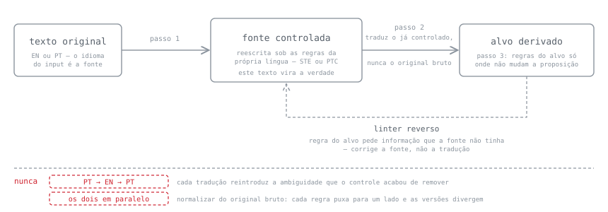

# Português Técnico Controlado (PTC)

Skill do [Claude Code](https://claude.com/claude-code) que reescreve texto técnico em português do Brasil para que ele tenha **uma leitura só**.

Quem executa um procedimento não pode parar para perguntar "você quis dizer X ou Y?". Um modelo que consome uma instrução também não. O texto precisa responder antes.

Inspirado no [ASD-STE100](https://www.asd-ste100.org/), o padrão de linguagem controlada da indústria aeroespacial. Não é uma tradução dele. O STE resolve os problemas do inglês, e o maior problema do português nem aparece lá: o inglês obriga o sujeito, então o padrão nunca precisou de uma regra para isso. As 8 regras daqui foram escritas do zero, e o porquê está no fim.

---

## Antes e depois

### 1. Runbook, nível `estrito`

Entrada:

```
Após o deploy, deve-se verificar os logs. Realize a validação da integridade dos
dados de backup do cluster de micro-serviços, garantindo que cada backup não
passe de 1.5 GB. Se houver erro, o mesmo deve ser reportado.
```

Saída:

> **Nível:** estrito · **Destinatário:** humano
>
> | Regra | Original | Reescrito |
> |---|---|---|
> | PTC-1 (`-se` apassivador) | `deve-se verificar os logs` | `verifique os logs` |
> | PTC-1 (`o mesmo`) | `o mesmo deve ser reportado` | `reporte esse erro` |
> | PTC-2 (gerúndio conector) | `garantindo que cada backup não passe` | frase própria: `Cada backup ocupa no máximo 1,5 GB.` |
> | PTC-4 (verbo-suporte) | `Realize a validação da integridade` | `Valide a integridade` |
> | PTC-5 (cadeia de `de`) | `dos dados de backup do cluster de micro-serviços` | `dos backups do cluster de microsserviços` |
> | PTC-7 (decimal) | `1.5 GB` | `1,5 GB` |
> | PTC-8 (hífen r/s) | `micro-serviços` | `microsserviços` |
>
> **Texto final:**
> Depois do deploy, verifique os logs. Valide a integridade dos backups do cluster de microsserviços. Cada backup ocupa no máximo 1,5 GB. Se o comando retornar erro, reporte esse erro.
>
> **Mantido de propósito:** `deploy`, empréstimo consagrado sem tradução fixada no glossário.

**Medido:** 12,3 → **7,5** palavras por frase · Flesch-PT 74,0 → 74,8.

O número que se move é o primeiro, e o segundo quase não sai do lugar — o ganho aqui não é o texto ficar mais fácil, é `deve-se verificar` virar uma ordem para quem lê e `1.5 GB` parar de significar mil e quinhentos. Os dois números saem de [`tests/legibilidade.py`](tests/legibilidade.py), a 4ª asserção do harness, e ela mede inchaço — não fidelidade nem repetição.

### 2. Comunicado interno, nível `leve`

Rigor de runbook em comunicado produz texto robótico. Esse é o erro clássico de quem adota linguagem controlada, e o motivo dos três níveis.

Entrada:

```
Pessoal, informamos que na próxima segunda-feira será realizada a migração do
servidor. O mesmo ficará indisponível das 22h às 02h. Estimamos que
aproximadamente 1,000 usuários serão impactados. Solicitamos que todos efetuem
o logout antes do horário.
```

Saída:

> **Nível:** leve · **Destinatário:** humano
>
> | Regra | Original | Reescrito |
> |---|---|---|
> | PTC-1 (`o mesmo`) | `O mesmo ficará indisponível` | `O servidor ficará indisponível` |
> | PTC-7 (milhar) | `1,000 usuários` | `1.000 usuários` |
>
> **Texto final:**
> Pessoal, informamos que na próxima segunda-feira será realizada a migração do servidor. O servidor ficará indisponível das 22h às 02h. Estimamos que aproximadamente 1.000 usuários serão impactados. Solicitamos que todos efetuem o logout antes do horário.
>
> **Mantido de propósito:** `informamos`, `Solicitamos` e `efetuem o logout` são verbo-suporte e léxico burocrático — PTC-4 e PTC-6 ficam **dispensadas** em `leve`. `será realizada` idem: voz passiva é livre neste nível.

**Medido:** 9,0 → 9,0 palavras por frase · Flesch-PT 35,3 → **32,9**.

A métrica não se move — e neste nível é isso que se espera dela, porque as regras que a moveriam estão dispensadas. Duas correções, e só: as outras quatro violações ficam de propósito, e são elas que seguram o tom. `1,000` sai porque PTC-1, PTC-7 e PTC-8 nunca relaxam — milhar à americana num texto em português é erro de ordem de grandeza, e ele não encolhe porque o comunicado é informal.

### 3. Saída para agente, flag `destinatário: agente`

Particípio isolado é o pior caso quando o consumidor é um modelo, porque a mesma string serve para evento e para estado.

Entrada:

```
Arquivo enviado.
```

Saída:

> **Nível:** estrito · **Destinatário:** agente
>
> | Regra | Original | Reescrito |
> |---|---|---|
> | Flag agente (status é sujeito + verbo finito) | `Arquivo enviado.` | `O agente enviou o arquivo.` |
>
> **Texto final:**
> O agente enviou o arquivo.
>
> **Mantido de propósito:** `Arquivo enviado.` lê como evento concluído **e** como propriedade do estado, e a entrada não decide qual. Assumido evento. Se for estado, a forma é `O arquivo está no estado ENVIADO.` — a skill declara a inferência em vez de escolher em silêncio.

A regra não tem número PTC próprio: pela tabela de violações, este caso é indistinguível de um PTC-1 comum. A flag muda mais duas coisas, e a segunda é a que importa aqui — **nenhuma anáfora atravessa frase**, porque o consumidor pode truncar a saída no meio.

### 4. Par EN/PT, com o português achando o buraco no inglês

Entrada:

```
The report should be sent after validation.
```

Saída:

> **Fonte:** inglês *(o idioma do input)* · **Modo:** bilíngue
>
> | Regra do PT | Original (EN) | Corrigido na fonte (EN) |
> |---|---|---|
> | PTC-1 (quem faz, aparece) | `The report should be sent` — quem envia? | `The scheduler sends the report` |
> | PTC-3 (modal unívoco) | `should` — obrigação ou expectativa? | presente factual: `sends` |
> | PTC-1 (nominalização sem ator) | `after validation` — quem valida, e o quê? | `after the gateway validates the token` |
>
> **Texto final (EN):** The scheduler sends the report after the gateway validates the token.
> **Texto final (PT):** O agendador envia o relatório depois que o gateway valida o token.
>
> **Ambiguidades resolvidas na fonte:** 3. As três já estavam no inglês original — nenhuma foi criada pela tradução.

Repare na coluna do meio: as perguntas são do **português**, e as três correções entraram no **inglês**. O inglês não obriga a declarar o ator na voz passiva; o português obriga. Quando uma regra do PT exige informação que o EN não tinha, o problema é ambiguidade na fonte, e é o único mecanismo que impede o tradutor de inventar o ator. Detalhe do pipeline em [Modo bilíngue](#modo-bilíngue).

---

## O problema

O português esconde informação em lugares onde o inglês obriga a declarar.

**Sujeito nulo.** `Envia o e-mail e atualiza o status.` A terceira pessoa do singular colapsa `ele`, `ela`, `você`, `o sistema` e `o usuário` numa forma só. O inglês resolve ao exigir o sujeito. O português, não.

**Modal sobrecarregado.** `O processo deve terminar em 5 minutos.` Regra ou estimativa? `deve` carrega obrigação e probabilidade na mesma palavra.

**Escopo decidido por vírgula.** `Os servidores, que falharam, foram reiniciados.` Todos falharam. Sem as vírgulas, só os que falharam foram reiniciados. Uma vírgula muda o escopo, e o erro fica invisível na revisão.

---

## Instalação

```bash
git clone https://github.com/kayquer/portugues-tecnico-controlado ~/.claude/skills/portugues-tecnico-controlado
```

O Claude Code registra a skill na próxima sessão. Sem dependências: nenhum pacote, nenhuma outra skill, nenhuma chamada de rede.

### Outros agentes

As regras são Markdown puro e não dependem do Claude Code. O que depende dele é o empacotamento — frontmatter YAML e `references/` carregadas sob demanda por caminho relativo. `dist/` traz o mesmo conteúdo achatado, com os caminhos reescritos para seções do próprio arquivo:

| Arquivo | Onde |
|---|---|
| [`dist/ptc-agents.md`](dist/ptc-agents.md) | Codex, opencode, Jules, Aider — copie para a raiz do projeto |
| [`dist/ptc.mdc`](dist/ptc.mdc) | Cursor, em `.cursor/rules/` |
| [`dist/ptc-completo.md`](dist/ptc-completo.md) | Claude.ai (Skill ou instruções de Projeto), ou qualquer agente com contexto grande |
| [`dist/ptc-compacto.md`](dist/ptc-compacto.md) | Versão sem exemplos, menos da metade do tamanho, para campo de instrução com limite |
| [`dist/ptc-chat.txt`](dist/ptc-chat.txt) | ChatGPT, Perplexity, Kimi — mesmo conteúdo do compacto, em texto puro |

**[A página de instalação](https://kayquer.github.io/portugues-tecnico-controlado/)** tem o comando ou o botão de copiar de cada um.

O modo bilíngue EN/PT só existe na versão completa: o pipeline tem ordem obrigatória e não sobrevive ao corte.

`dist/` e `docs/index.html` são gerados por `tools/build.py` — não edite à mão. `./init.sh` recusa rodar a suite completa se estiverem defasados.

## Uso

Invoque pelo nome:

```
/portugues-tecnico-controlado
```

Ou descreva a tarefa em linguagem natural:

- "reescreve esse runbook em português controlado"
- "tira a ambiguidade desse texto"
- "quero esse procedimento em EN e PT"
- "revisa esse comunicado"

Quando você não especifica, a skill classifica o nível de rigor e o destinatário sozinha, e declara o que assumiu na primeira linha da resposta. A saída é sempre a mesma da seção anterior: tabela nomeando a regra violada em cada trecho, texto final, e nota sobre o que ficou como estava.

---

## As 8 regras

PTC-1 a PTC-5 tratam de **desambiguação** e exigem julgamento. PTC-6 a PTC-8 tratam de **consistência**, funcionam de forma mecânica, e nunca relaxam.

| | Regra | Resumo |
|---|---|---|
| **PTC-1** | Quem faz, aparece | Sujeito explícito. Sem `-se` apassivador, sem `o mesmo`, sem clítico de 3ª pessoa. |
| **PTC-2** | Uma proposição por frase, uma forma verbal | Imperativo para instrução, presente 3ª pessoa para comportamento. Sem gerúndio conector. |
| **PTC-3** | Modalidade e quantidade explícitas | `deve` = obrigação. Probabilidade nunca por modal. Quantificador vago vira número. |
| **PTC-4** | Verbo pleno, não verbo-suporte | `realizar a validação` → `validar`. |
| **PTC-5** | Sintaxe plana | Adjetivo pós-nominal. Cadeia de `de` ≤ 2. Nada entre verbo e objeto. |
| **PTC-6** | Termos congelados, variante BR | Um conceito, um termo. Fixa o português brasileiro. |
| **PTC-7** | Formato de número, data e unidade | Vírgula decimal em PT. Datas em ISO 8601 nos dois idiomas. |
| **PTC-8** | Ortografia PT-BR vigente | Acordo de 1990, obrigatório no Brasil desde 2016-01-01. |

Três delas, em uma linha cada:

| Regra | Original | Reescrito |
|---|---|---|
| **PTC-1** | `Envia o e-mail e atualiza o status.` | `O serviço envia o e-mail. O worker atualiza o status.` |
| **PTC-3** | `O processo deve terminar em 5 minutos.` | `O processo termina em até 5 minutos.` |
| **PTC-5** | `a validação do cadastro do cliente do contrato` | `Valide o cadastro. Esse cadastro pertence ao cliente do contrato.` |

A PTC-8 é higiene, não o ponto da skill: o Acordo de 1990 é regra fechada, e um corretor resolve boa parte dele. Fica porque um caso concentra quase todo o erro em texto de TI — prefixo terminado em vogal + palavra começada por `r` ou `s` junta e dobra a consoante (`micro-serviço` → **microsserviço**, `auto-serviço` → **autosserviço**, `anti-racismo` → **antirracismo**). O resto do Acordo, a acentuação e as armadilhas de vocabulário técnico ficam em [`references/ortografia-ptbr.md`](references/ortografia-ptbr.md), carregado sob demanda.

---

## Níveis de rigor

| Nível | Uso |
|---|---|
| `estrito` | procedimento, runbook, saída de agente |
| `descritivo` | documentação de sistema |
| `leve` | comunicado interno |

PTC-1, PTC-7 e PTC-8 **nunca relaxam**. Em comunicado, `o mesmo foi cancelado` e `1,000 clientes` continuam causando dano, e ortografia errada não fica menos errada porque o texto é informal.

Uma exceção dentro da PTC-1: o `-se` apassivador é proibido só em `estrito`. Em documentação de sistema, `Verifica-se a integridade dos arquivos` fica, a mesma licença que `descritivo` dá à voz passiva sem ator. Explicitar um ator que o texto não tem é inventar fato.

O resto sai em `leve`. O léxico controlado fica dispensado e a primeira pessoa passa a ser desejável.

### Flag `destinatário: agente`

Atua sobre `estrito` e muda três coisas:

1. Instrução ao agente usa imperativo; descrição de ferramenta usa presente na 3ª pessoa.
2. Nenhuma anáfora atravessa frase, porque o consumidor pode truncar o texto.
3. Status usa sujeito e verbo finito, nunca particípio isolado.

---

## Modo bilíngue

**A fonte de verdade é o idioma do input**, não um pivô fixo em inglês:

| Input | Fonte | Derivado |
|---|---|---|
| Inglês | inglês controlado (regras STE) | português controlado |
| Português | português controlado | inglês controlado |

1. A skill reescreve **na língua fonte**, sob as regras dela.
2. A skill traduz **o texto já controlado**, nunca o original bruto.
3. A skill aplica as regras da língua alvo só onde elas não alterem a proposição.

<p align="center">
  
</p>

A aresta de retorno é a parte que não cabe em prosa, e é ela que faz o desenho valer. O caminho `PT → EN → PT` nunca acontece: cada tradução reintroduz a ambiguidade que o controle acabou de remover. O risco maior nem é esse. É a **normalização divergente**, quando alguém normaliza os dois idiomas em paralelo a partir do original bruto: cada conjunto de regras puxa para um lado e as duas versões passam a afirmar coisas diferentes.

Se no passo 3 uma regra do português exigir informação que o inglês não tinha, a skill volta ao passo 1 e corrige o inglês. Esse é o único mecanismo que impede o tradutor de inventar o ator.

**Verificação de equivalência.** A skill extrai uma tabela de proposições de cada versão de forma independente e compara célula a célula:

| # | ator | ação | objeto | condição | resultado/erro | valor+unidade | modalidade |
|---|---|---|---|---|---|---|---|

Falha quando uma célula existe numa versão e não na outra, quando a contagem de passos imperativos difere, ou quando um termo do glossário aparece traduzido de dois jeitos. Detalhes em [`references/ingles.md`](references/ingles.md).

---

## Escopo

**O que a skill faz**

- Reescreve texto em português para leitura única, e nomeia a regra que cada trecho violava.
- Preserva todo fato, condição e qualificador de escopo do original.
- Gera o par EN/PT com verificação de equivalência proposicional.
- Ajusta o rigor ao leitor, em vez de aplicar tudo sempre.
- Aplica a ortografia do Acordo de 1990, com atenção ao vocabulário de TI.

**O que a skill não faz**

- **Não reproduz o dicionário de ~900 palavras aprovadas da ASD.** Esse documento é o download oficial deles, gratuito em [asd-ste100.org](https://www.asd-ste100.org/). A skill aplica o princípio (a palavra mais simples disponível, sempre usada do mesmo jeito) em vez de checar contra lista fixa.
- **Não entrega documentação aeroespacial certificada em STE.** Para isso, o padrão oficial é a fonte de verdade.
- **Não marca variante de português europeu como erro.** `utilizador`, `ecrã` e `ficheiro` estão corretos em PT-PT. A skill *fixa* a variante brasileira por consistência de projeto.
- **Não trata convenção de estilo como norma.** `front-end`/`frontend` e `data center`/`datacenter` são empréstimos que o VOLP não hifeniza. A skill documenta a escolha em vez de apontar erro.
- **Não simplifica texto criativo ou persuasivo.** Copy de marketing perde o que importa sob linguagem controlada.
- **Não corta condição de segurança nem qualificador de escopo para encurtar frase.** Sinaliza o custo em vez disso.

---

## Por que não é o STE traduzido

Traduzir as 53 regras do ASD-STE100 uma a uma não funciona, por duas razões simétricas.

**Metade das regras fica vazia em português.** "Uma classe gramatical por palavra" existe porque em inglês `oil` funciona como substantivo e verbo sem mudar de forma. Em português a morfologia já separa `óleo` de `lubrificar`. O limite de cluster nominal também quase não se aplica: o português converte pilha de substantivos em sintagma preposicionado, e o problema migra para a cadeia de `de`.

**Os vícios reais do português ficam descobertos.** O inglês obriga o sujeito, então o STE nunca precisou de uma regra para isso, enquanto o sujeito nulo é a maior fonte de ambiguidade que o português tem. O mesmo vale para o `-se` apassivador, a posição do adjetivo, o gênero gramatical criando correferência falsa, e a relativa explicativa distinguida só por vírgula.

**Não existe norma equivalente.** Não há "Simplified Technical Portuguese", nem da ASD, nem da ABNT, nem da ABRAT. Existe pesquisa acadêmica isolada ([Gomes 2011](https://repositorio.ulisboa.pt/entities/publication/96c94c8d-9505-497b-be92-bbaa18cd7a43), Universidade de Lisboa; UFSC 2014), sem adoção industrial. Esta skill não implementa uma norma. Ela aplica o *princípio* da linguagem controlada às características reais do português.

**Sobre a prática da indústria.** Circula a ideia de que fabricantes escrevem em STE e traduzem depois. A evidência não sustenta isso. A Embraer escreve a documentação dos E-Jets em Simplified English e o mercado brasileiro consome os manuais em inglês, mas ali o inglês é imposição regulatória (ICAO/ATA iSpec 2200), não escolha de qualidade. A alegação de que linguagem controlada melhora tradução também é empiricamente modesta: O'Brien (Dublin City University) mediu o efeito com eye-tracking e encontrou ganho real, porém marginal, concentrado em textos já complexos. Na tradução automática, o texto controlado em francês produziu 51 erros contra 45 do original.

---

## Estrutura

```
portugues-tecnico-controlado/
├── SKILL.md                        # 8 regras, 3 níveis, processo, formato de saída
├── references/
│   ├── lexico.md                   # evite→use, conectores ambíguos, variante BR, siglas
│   ├── ortografia-ptbr.md          # Acordo de 1990, armadilhas de TI, o que não é erro
│   └── ingles.md                   # regras STE-EN, pipeline bilíngue, decalques e falsos amigos
├── dist/                           # versões portáteis, geradas — não edite à mão
├── docs/index.html                 # página de instalação, gerada — não edite à mão
├── tools/build.py                  # gera dist/ e docs/ a partir da skill
├── tests/                          # harness de regressão
├── loops/                          # goal loops e estado entre sessões
├── requirements.txt                # dependência do harness — a skill não usa
├── init.sh                         # roda a verificação
└── AGENTS.md                       # como editar a skill sem quebrá-la
```

**A skill é `SKILL.md` + `references/`.** O resto do repositório é harness de desenvolvimento e não vai para o prompt. Os arquivos de `references/` carregam sob demanda: `ortografia-ptbr.md` entra quando surge dúvida de grafia, `ingles.md` entra só quando o par EN/PT importa.

---

## Desenvolvimento

> ⚠️ **Este repositório contém português errado de propósito.** Os casos em `tests/casos/` e os exemplos marcados `❌` são o material de trabalho da skill. Corrigi-los quebra a skill em silêncio. Leia [`AGENTS.md`](AGENTS.md) antes de editar qualquer coisa.

```bash
./init.sh                     # roda todos os casos de regressão
./init.sh caso-01             # um caso só
./init.sh --cobertura         # matriz de cobertura, não chama a API, é instantâneo
./init.sh --metricas          # legibilidade antes/depois, sem gatear (calibra os limiares)
PTC_MODELO=opus ./init.sh     # outro modelo (default: sonnet)
PTC_TENTATIVAS=1 ./init.sh    # sem retry, para medir instabilidade
```

O runner concatena `SKILL.md` + `references/*.md` **deste repo** e manda para `claude -p`. Ele testa o arquivo que você acabou de editar, não a cópia instalada em `~/.claude/skills/`.

Como output de LLM não é determinístico, ele não compara texto. Verifica quatro coisas:

- **cobertura**: toda regra de `espera:` apareceu na tabela de violações
- **falso positivo**: todo termo de `nao-marca:` sobreviveu intacto no texto reescrito
- **âncora**: todo termo de `deve-conter:` apareceu na saída
- **legibilidade**: o texto final passa dos limiares `flesch-min:`/`pal-frase-max:` do caso

O segundo é o que impede a skill de virar um corretor que "conserta" português correto. O terceiro cobre o que não tem número de regra próprio: a flag `destinatário: agente` e o pipeline bilíngue, que pela tabela de violações seriam indistinguíveis de um caso comum. O quarto mede a prosa, que os outros três não olham — a skill podia devolver reescrita correta e ilegível com todos os casos verdes. É o Flesch adaptado ao PT-BR (Martins et al. 1996) calculado sobre os contadores do [textstat](https://github.com/textstat/textstat); a fórmula é do projeto porque o textstat não tem português, e cada limiar é medido, nunca escolhido a olho.

Cada regra precisa de **dois** casos: um que a faz disparar e um contra-teste que prova que ela não dispara onde não deve. `./init.sh --cobertura` monta essa matriz e sai 0 quando ela fecha.

Fluxo completo, definition of done e clean-state checklist em [`AGENTS.md`](AGENTS.md). Requisitos do harness: [Claude Code](https://claude.com/claude-code), Python 3 e `pip install -r requirements.txt` (textstat, para a métrica de legibilidade). **Usar a skill não precisa de nada disso** — ela é Markdown.

---

## Como este projeto foi construído

Uma skill é um prompt, e prompt não tem compilador. Não existe erro de sintaxe quando uma regra passa a se contradizer, nem stack trace quando ela começa a "consertar" português que já estava certo. Todo o resto deste repositório existe para responder a uma pergunta só: **como saber se uma mudança no texto da skill melhorou ou quebrou alguma coisa.**

### As regras vieram do português, não da tradução

O ponto de partida foi o ASD-STE100 — o inglês técnico simplificado da indústria aeroespacial. Traduzir as 53 regras dele não funciona, e a seção [Por que não é o STE traduzido](#por-que-não-é-o-ste-traduzido) explica por quê: metade vira regra vazia em português, e os vícios que mais causam ambiguidade em português (sujeito nulo, `-se` apassivador, posição do adjetivo, escopo decidido por vírgula) o STE nunca precisou cobrir, porque o inglês obriga o sujeito.

As 8 regras foram escritas do zero contra as características reais do idioma. Não existe norma equivalente para o português — nem da ABNT, nem da ASD — então isto não implementa um padrão, aplica o princípio da linguagem controlada.

### O harness não compara texto

A tentação óbvia é gravar a saída esperada e comparar. Não funciona: output de LLM não é determinístico, e um teste assim fica vermelho por sinônimo trocado.

O runner ([`tests/verify.py`](tests/verify.py)) concatena `SKILL.md` + `references/*.md` **deste repositório** — não a cópia instalada — manda para o modelo e verifica quatro coisas sobre a resposta:

| Asserção | Chave do caso | O que prova |
|---|---|---|
| cobertura | `espera:` | a regra apareceu na tabela de violações |
| falso positivo | `nao-marca:` | um termo correto sobreviveu intacto ao texto final |
| âncora | `deve-conter:` | comportamento sem número PTC próprio aconteceu |
| legibilidade | `flesch-min:` / `pal-frase-max:` | a reescrita não é correta-e-ilegível |

Cada regra precisa de **dois** casos: um positivo, que a faz disparar, e um contra-teste, que prova que ela não dispara onde não deve. `./init.sh --cobertura` monta essa matriz e é grátis — não chama a API.

**Oscilação é tratada como dado, não como ruído.** Rodando a suite três vezes sem mudar nada, casos *diferentes* falhavam a cada rodada. Por isso o runner repete cada caso até 3 vezes e distingue quatro estados: `PASS`, `FLAKY` (passou numa retentativa — conta como ok, mas aparece destacado), `ESCALOU` (falhou no modelo menor e passou no maior — é colisão de rótulo, não quebra) e `FAIL`. Sem essa separação, o gate acusaria regressão inexistente e apontaria um culpado diferente toda vez.

### Goal loops com critério mecânico de parada

As melhorias não vêm de "achar que já deu". Cada frente de trabalho é um arquivo em [`loops/`](loops/) no formato do [learn-harness-engineering](https://github.com/walkinglabs/learn-harness-engineering) (lecture-13), com objetivo, verificação executável, condição de parada e restrições explícitas. O loop roda com `/loop` — o agente se auto-pauta e para no critério do próprio arquivo, não quando parece suficiente.

| Loop | Critério de parada | Estado |
|---|---|---|
| `goal-cobertura.md` | `./init.sh --cobertura` sai 0 | fechado — 8/8 positivo, 8/8 contra-teste |
| `goal-falso-positivo.md` | `PTC_ADVERSARIAL=1 ./init.sh --cobertura` sai 0 | aberto — 4/8 |

O segundo existe porque o primeiro fechou com contra-testes escritos **junto com a regra**, pelo mesmo raciocínio que a regra usa. Todos testam a leitura legítima óbvia (`o serviço se reinicia` não é `-se` apassivador). Nenhum testa português correto que *se parece* com a violação — que é o modo de falha que mais escapa. O contra-teste adversarial parte de um texto bom e pergunta o que a regra pode confundir com erro.

Uma restrição dura do loop de caça: ele **não conserta**. Achar o falso positivo é o produto; consertá-lo é outra sessão. Um loop que caça e conserta na mesma rodada não sabe dizer se o conserto criou o próximo achado.

### A métrica de legibilidade é código do projeto

As três primeiras asserções medem **qual regra disparou**, nunca o texto. O buraco era demonstrável: uma saída com a tabela citando as 8 regras corretas e o texto final `banana front-end banana usuário banana` passava.

A quarta asserção fecha isso, e a implementação é do projeto por um motivo específico: **o [textstat](https://github.com/textstat/textstat) não tem português.** `set_lang("pt_BR")` não levanta erro — cai nas constantes do inglês em silêncio, e devolve um número calibrado para inglês sobre texto português. Do textstat se usa só o que vale em PT (contagem de sílabas via Pyphen, que tem dicionário `pt_BR`; palavras; frases), e o cálculo é o **Flesch adaptado ao português por Martins et al. 1996** (USP São Carlos), que reescreve os pesos porque palavra em português é cerca de três vezes maior que em inglês.

**Limiar se mede, não se chuta.** `./init.sh --metricas` roda os casos e imprime entrada × saída sem gatear; o número só vira chave depois de 5 medições, com margem, e confirmado 5/5. Três dos casos têm limiar hoje — os outros foram reprovados na medição por não medirem nada.

### O que o processo encontrou

O valor do harness não é o verde. É isto:

| Achado | Como apareceu |
|---|---|
| A skill se contradizia sobre `apenas` — prescrito numa regra, condenado no léxico | oscilação: o modelo decidia diferente a cada rodada |
| Plural de sigla saía etiquetado como PTC-8 em vez de PTC-6 | 4/5 na citação, 6/6 na correção — era rótulo, não lacuna |
| Duas âncoras de teste eram moeda ao ar | medição 5× reprovou; consertadas na **entrada**, não encurtando a âncora |
| Um check do próprio runner era código morto | o primeiro caso adversarial escrito derrubou a suite sem existir regressão |
| Um limiar de legibilidade falhava 28% das vezes | `FLAKY` na suite; a calibração tinha ignorado duas medições avulsas discordantes |

Nenhum desses aparece lendo o código. Todos apareceram porque existia um número para conferir e uma condição de parada que não aceitava opinião.

---

## Fontes

- [ASD-STE100, site oficial](https://www.asd-ste100.org/) · [FAQ](https://asd-ste100.org/STE_faq.html)
- [ASD Europe, Simplified Technical English](https://www.asd-europe.org/standards-specifications/simplified-technical-english/)
- O'Brien, [*Controlled Language and Readability*](https://doras.dcu.ie/17153/1/OBrien_CL_and_Readability.pdf), Dublin City University
- Gomes 2011, [*Contributos para um português controlado*](https://repositorio.ulisboa.pt/entities/publication/96c94c8d-9505-497b-be92-bbaa18cd7a43), Universidade de Lisboa
- [Decreto nº 6.583/2008](https://www.planalto.gov.br/ccivil_03/_ato2007-2010/2008/decreto/d6583.htm), Acordo Ortográfico no Brasil
- [VOLP, Academia Brasileira de Letras](https://www.academia.org.br/nossa-lingua/busca-no-vocabulario), fonte autoritativa de grafia
- [Base XVI, hífen, texto normativo](https://www.flip.pt/Acordo-Ortografico/Texto/Base-XVI-Do-hifen-nas-formacoes/)

Três pontos a pesquisa não confirmou, e a skill trata como convenção em vez de citar norma inexistente: norma ABNT dedicada a itálico em estrangeirismo de documentação técnica, API pública do VOLP, e menção literal de `além-`, `aquém-` e `recém-` na Base XVI.

## Créditos

O conceito de aplicar o ASD-STE100 como skill de agente veio de [danyuchn/asd-ste100-skill](https://github.com/danyuchn/asd-ste100-skill) (MIT). Este projeto reescreve as regras do zero para o português e não compartilha código com ele.

O ASD-STE100 pertence à [ASD](https://www.asd-europe.org/), AeroSpace and Defence Industries Association of Europe. Este projeto não tem vínculo com a ASD e não distribui o conteúdo do padrão.

## Licença

MIT, ver [LICENSE](LICENSE).
